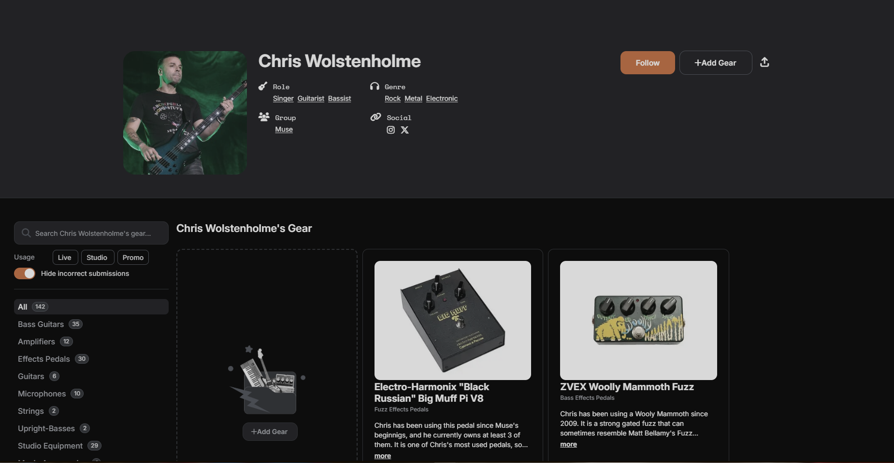

# August 24: Planning

I've been woking with electronics in music a lot recently, and i fell into the rabbit hole of DIY PEDALS. I've watched lots of videos of people making their own pedals through kits, or schematics, and i've been really curious about analog signaling recently, so i wanted to give it a try.

I didnt want to just put together a kit, i want to make it from the start. And i don't want to just make one, i've desided to make a full on pedal board of different pedals with different effects in just one PCB. I think a project like this might be quite fun and i might learn more in depth about this analog signals, since in my last and first proyect i was learning quite in a rush while making it.

As a reference, i've decided to make a pedal board based on the main gear used by Muse bassits Chris Wolstenholme, since a really dear person of mine bought a bass a bit recently, she loves Muse and chris, and i though a give like this might make her happy while helping me understand more about this topic.

From [equipboard](https://equipboard.com/pros/chris-wolstenholme), i've decided to use:

- "Black Russian" Big Muff Pi V8

- ZVEX Woolly Mammoth Fuzz

- Human Gear Animato

- Boss OS-2 OverDrive/Distortion
  

**Hours: 1**

