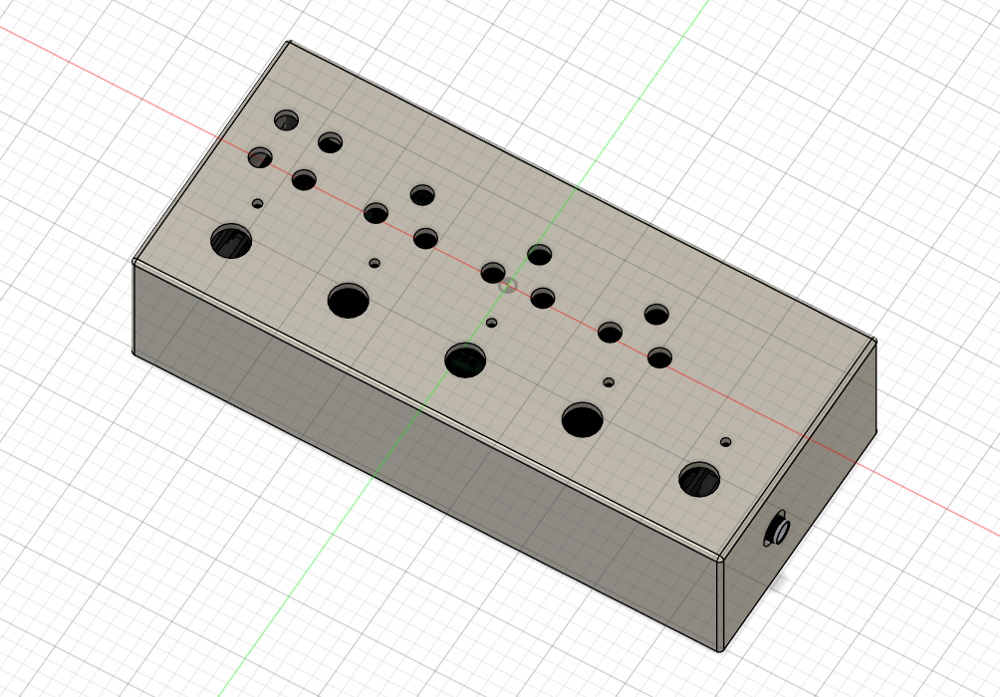
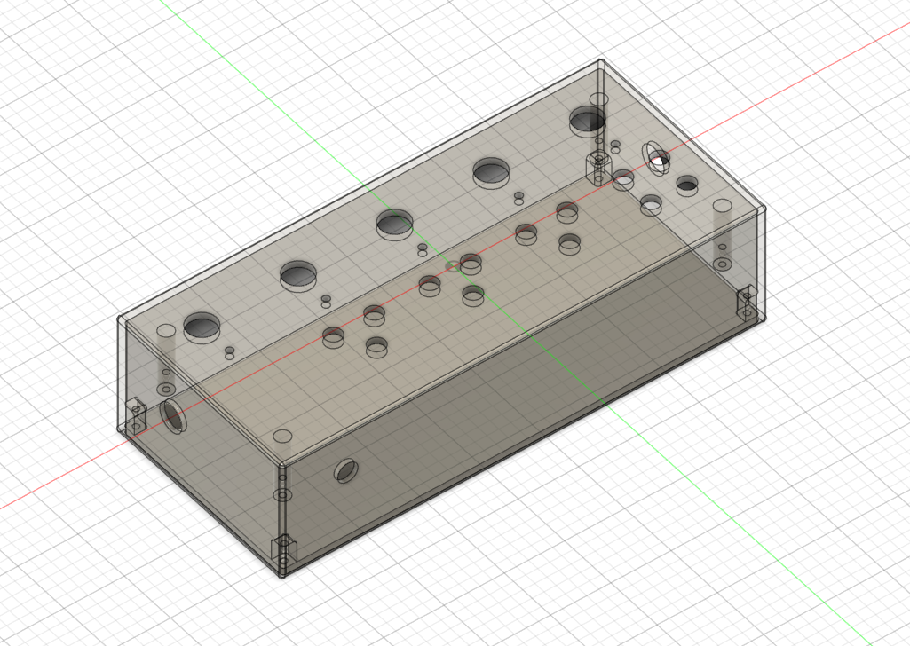
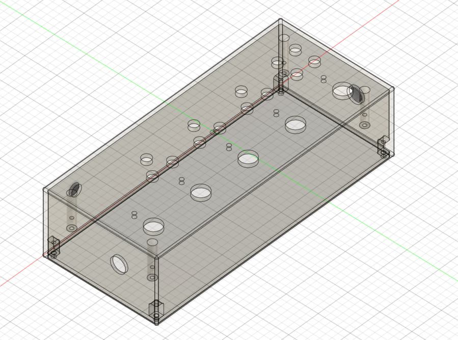
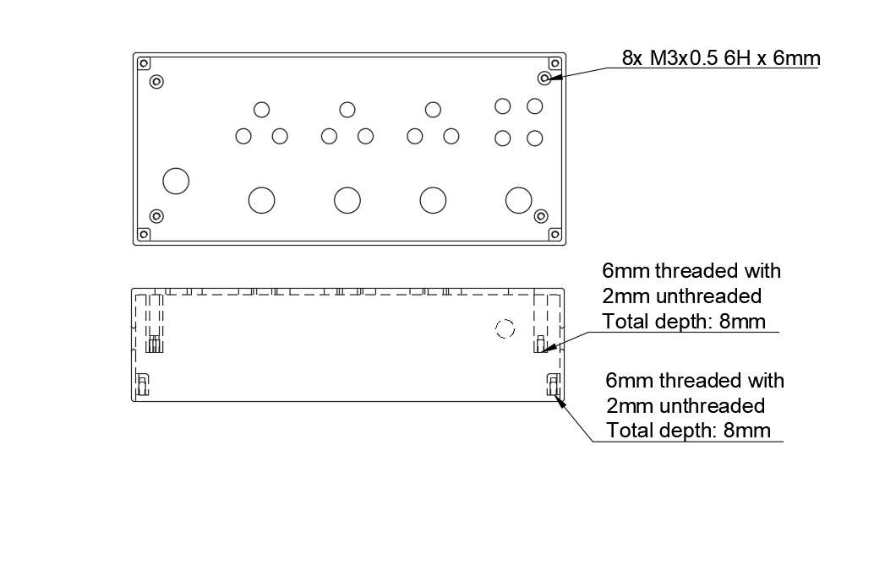
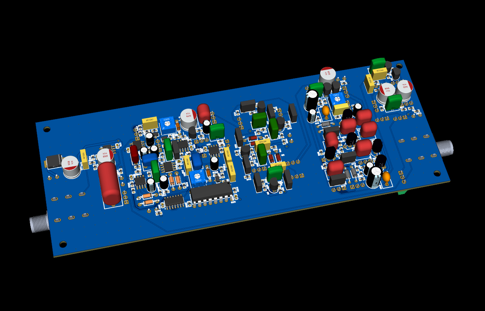
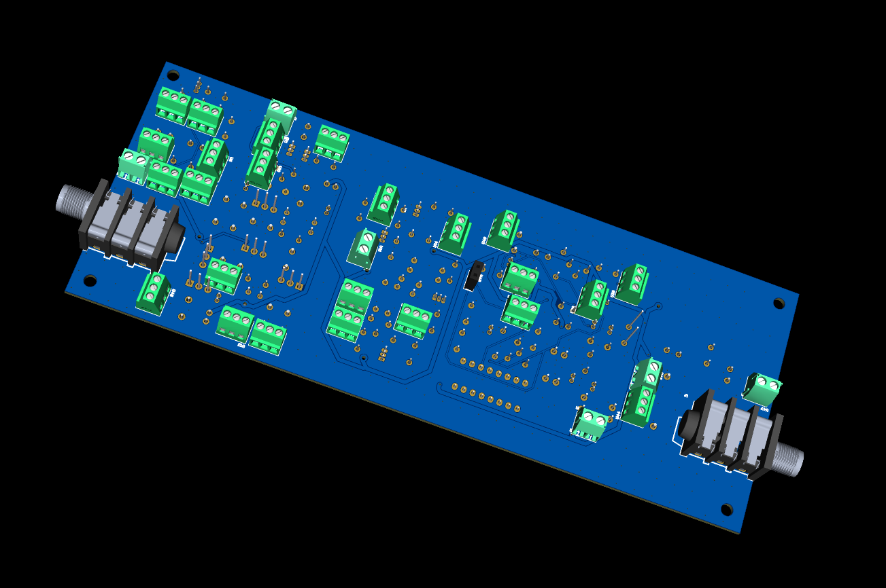
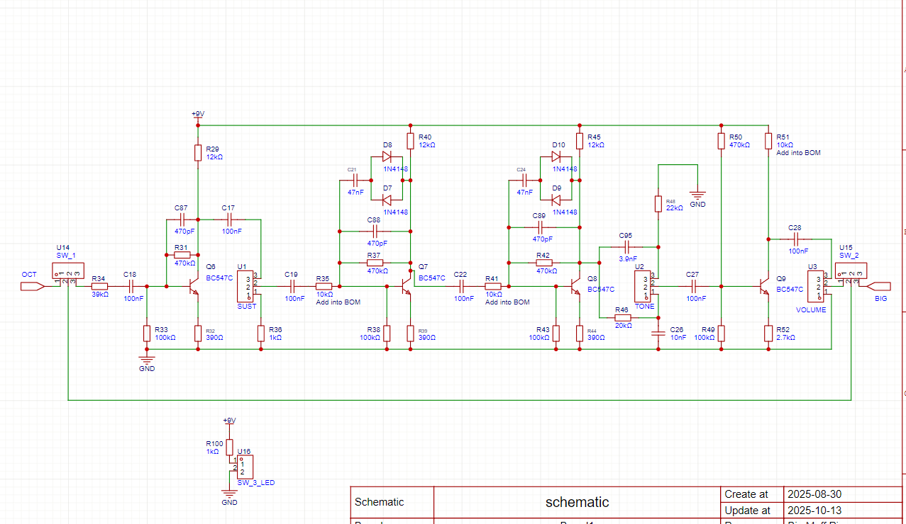

<h1 align="center">
   
  
   
  MUSE PEDAL
   
</h1>

<h4 align="center">Project files for a Muse bass pedal board.</h4>

  <a href="#key-features">Key Features</a> •
  <a href="#case-and-cad">Case & CAD</a> •
  <a href="#pcb">PCB</a> •
  <a href="#bom">BOM</a> •
  <a href="#credits">Credits</a> •
  <a href="#license">License</a>

<!---

--->

## Key Features

- Based on the pedalboard of Muse’s bassist, Chris Wolstenholme.

- All-in-one PCB pedalboard combining four classic analog effects:
Big Muff Pi (Black Russian), Woolly Mammoth, Human Gear Animato, and Boss Octaver.

- True bypass system with optional full-board bypass switch.

- Pre-buffered input to maintain signal strength across all pedals.

- Film capacitors on coupling and filter stages for improved tone stability and low tolerance.

- Compact two-layer PCB design — top layer for audio, bottom for power, with stitched ground planes to reduce noise.

- Reverse polarity protection using Schottky diode for safe power input.

- Custom-designed case in Fusion 360, CNC-ready with bottom-mounted lid for a clean top surface.

## Case and CAD

Custom CNC-milled aluminum enclosure designed for durability and clean aesthetics.

Designed in Fusion 360.

 
Threaded M3 screw holes for lid and pcb mounting

## PCB and Schematic

All-in-one PCB integrating four analog effects with optimized signal routing and grounding. Designed for minimal noise, compact, easy wiring through screw terminals, and full bypass control for each pedal.

## BOM

Everything you need to build the MUSE PEDAL:

- PCBA
- CAD
- 2x 2k log taper pot
- 1x 10k log taper pot
- 4x 100k linear taper pot
- 4x 100k log taper pot
- 1x 100k log dual gang 
- 1x 500k log taper pot
- 5x Stomp switches
- 1x DC Jack 2.1mm x 5.5mm 
- 8x M3 6mm screws

## Credits

This project uses:

- [EasyEDA](https://easyeda.com/)
- [Fusion 360](https://www.autodesk.com/products/fusion-360/overview)

## License

MIT

---

> GitHub [@Sojoooo](https://github.com/Sojoooo)